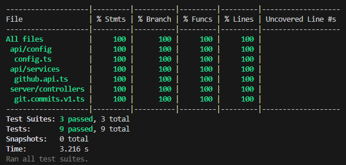

# RestFul API
  
This project is a RESTful API developed using Express.js, designed to facilitate ETL (Extract, Transform, Load) processes.


## Endpoints

1. ### /ping
- Designed for a quick evaluation of a `200 OK` response and string  `PONG!`

2. ### /healthcheck
- Designed to provide a health status of the server, returning a `200 OK` response along with a JSON object that includes the server's uptime. This endpoint is ideal for monitoring and evaluating the continuous operation of the API.

3. ### v1/api/commits/:owner/:repo
- It dynamically returns a JSON response containing the list of commits based on the specified owner and repository parameters. The API responds with a `200 OK` status and a JSON body if the request is successful, and a `500 Internal Server Error` if the provided parameters are incorrect or if there's an issue with processing the request.
  

## Environment Setup

Before running the server, make sure to set up the environment variables by creating a `.env` file based on the provided `env.example` file. Fill in the necessary information GitHub API and run API.


The values of PORT and Version of API, have a default value:

```bash
PORT  =  3001
VERSION  =  1
```


## Testing

To run the tests for the server, use the following command:

```bash
npm  run  test
```

Coverage of testing has the project, follow this command:

```bash
npm  run  test:coverage
```



The minimum accepted is 90%

  

## Running the Application

Depending on your environment (local development or production), use the following commands to run the application:

  

### In Local Development

Use this command if you are running the application in a local development environment:

```bash
npm  run  start:dev
```

  

## Production:

```bash
npm  run  start
```
  

### Building the Application

If it's necessary to build the TypeScript files before running the application, use this command:

```bash
npm  run  build
```

## Documentation

Includes a Postman collection designed for ease of use and accessibility. The collection contains pre-configured requests for all the API endpoints in this project: [Collection](documentation/postman/FullTimeForce-API.postman_collection.json) and  [EnvVars](documentation/postman/FullTimeForce-Local.postman_environment.json)